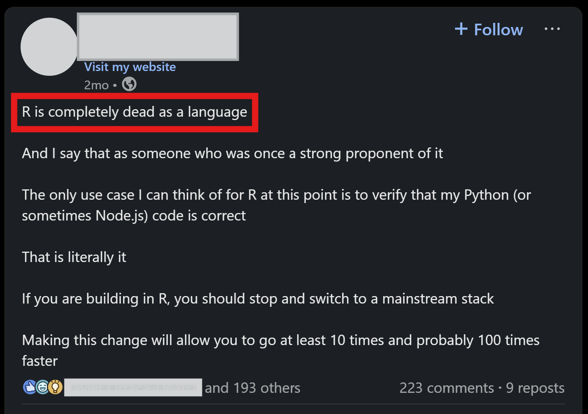

## Language Wars!

## The Reality

> Amost everything that used to make Python awesome that wasn't in R has been since ported over to R. And everything that used to make R awesome that wasn't in Python has been since ported over to Python.

<!-- ## Strengths & Weaknesses

- {shiny} ecosystem in R
    + {shinyWidgets}
    + {echarts4r}

- Vast size of {python} package ecosystem -->

## Keys

- Environment Management
- Git-based SDLC workflow
- Package choices
    + How easy would it be for an R dev to review my Python code (and vice versa)?
- Documentation
    + Detailed READMEs
    + Detailed code commenting + docstrings / roxygen
- Single point of execution
    + The software should take 1 action to "do the thing"
    + sometimes 2 actions (if you must)
    + Package framework
- Repository Structure Standards
    + I should see familiar folder names / file names in code repositories
- Team communication
    + EMPATHY

## Environment Management

* "It works on my machine"
    + Still lots of folks out there dealing with this day in & day out
    + Also people that don't care -- because they are essentially a lone wolf
        + I still think these people should care about this... it's a short-sighted approach
* Requires 3 things:
    + Operating System
    + Python and/or R version
    + Package versions
* There are a few options:
    + Third party tools (Posit Workbench)
    + Docker
    + Nix
* Going the open source approach requires some DevOps skillsets
    + Need to ask yourself if that's something you want to undertake or not
    + Cost / benefit of 3rd party tools (not saying Posit tooling doesn't have another million incredible features -- I'm just looking at this from an environment management standpoint)

## Git-Based SDLC Workflow

* Need to be using git -- I'm not going to spend my time today trying to convince you of that -- there's way more folks out there who can articulate that argument better than I can; but let's assume you are
* Protected `main` branch
* A commit to `main` triggers the process to run
    + Or it's a scheduled cron job
* A commit to a `dev` branch may run checks and tests
    + Even better, you can only merge the `dev` branch into `main` if you have passed all those checks
* New features / bugs present as "Issues" in the repository
* Issues become PRs
* PRs get reviewed and merged

## Package Choices

* How easy would it be for someone who knows R to review my Python code (and vice versa)?
* Trade pandas for polars
* Use {dplyr}
* Use DuckDB!
    + Also, if you didn't know it, you can write SQL in polars 🤯
* Use {great-tables} (Python) or {GT} (R)
* Use {plotnine} (Python) or {ggplot2} (R)
* Comment comment comment
* If you're coming from Python and working with an R team that doesn't have a lot of OOP experience (I'd argue that R is used more as a  functional programming language than it is an OOP language), you may want to avoid OOP when a functional approach is just as good

## Documentation

* Docstrings / Roxygen should be structured similarly
* Quarto!
* GitHub Pages
* Standardized approach to READMEs
* Robust explanations within GitHub Issues and PRs (should feel like hand-holding)
    + This can be hard in a fast-paced environment with tight deadlines, but it will *save* you time in the long run (assuming you're actually taking the time to review)

## Single Point of Execution

* You should be able to clone the repository, perform one action to get the environment set up, and then run one command (MAYBE 2 commands) to "do the thing"
    + Run the App
    + Start the API
    + Render the report
    + Do the ETL and store it in the database
    + etc.

## Repository Structure Standards

At a minimum...

* Some top level script that "does the thing" (`app.py`, `app.R`, `main.py`, `main.R`)
* A README that:
    * Explains the purpose of the software
    * Defines requirements
    * Explains how to get up-and-running and use the software (i.e., "Clone this repository, create a `.Renviron` file with the following environment variables set, from an R terminal run `renv::restore()`, then run the `main.R` script")
    * Explains the structure of the repository
    * Collaboration instructions
    * Mermaid JS is your friend!
* A folder for your custom logic
* Probably some sort lock file for defining package versions and maybe even R/Python version

## Communication

* Use Slack not Teams (I'm kidding -- kind of)
* Empathy for the reviewer / other team member
    + Document document document
* Staying on top of the latest & greatest
    + If you find a great new package, don't just start using it in a current or new project where other team members are involved; tell them about it first, and make the case for switching to it (and get everyone on board -- it should be a democracy) before actually switching to it
* Empathy in general
    + Our team is actually international -- there are folks for whom English is their second language; the idiosynchracies that exist within each of our native languages can lead to someone saying something that may be interpreted as incorrect or even offensive -- make sure you figure out what their intention was with that statement before reacting
    + If you're on the other side of that, make sure you're using language that's as straightforward as possible, or preface what you want to say with something like "I don't know if I'm saying this right..."
    + This can be just as much the case with 2 individuals who are both native English speakers

# Feedback
- Too much -- going to run out of time
- Option 1:
    + Cut things and focus on a couple of topics (I can stay deep on those)
- Option 2:
    + Organize sub-bullets into broader themes/mantras
- Emphasize the Communication section
    + Sets the stage for everything else (maybe earlier in presentation?)
- *Why* even be multilingual?  Especially if I'm saying that everything great in one language has been ported to another...
    + Diversity increases capacity to tackle difficult tasks
    + Can talk about how our clients may have a preference (we ask them "Do you want the solution in R or Python?")
- Discuss the reality of what we've actually found to work for our team / what hasn't worked
- Will get more engagement if I tell tangible stories w/ specific examples
- Is there a mantra to go with the different sub-bullets?  I.e., for package choices, take the perspective of the reviewer
- Start the talk by emphasizing the importance of EMPATHY
    + Contrast it to the LinkedIn post
    + Sure Node.js may make you the fastest app, but is it an empathic choice?  Is this creating tech debt?

- Are the commands a makefile or internal functions? Is consistency the goal?
- Nit: Don’t talk about the specific  dev  branch, but maybe a “side” branch or a PR branch
